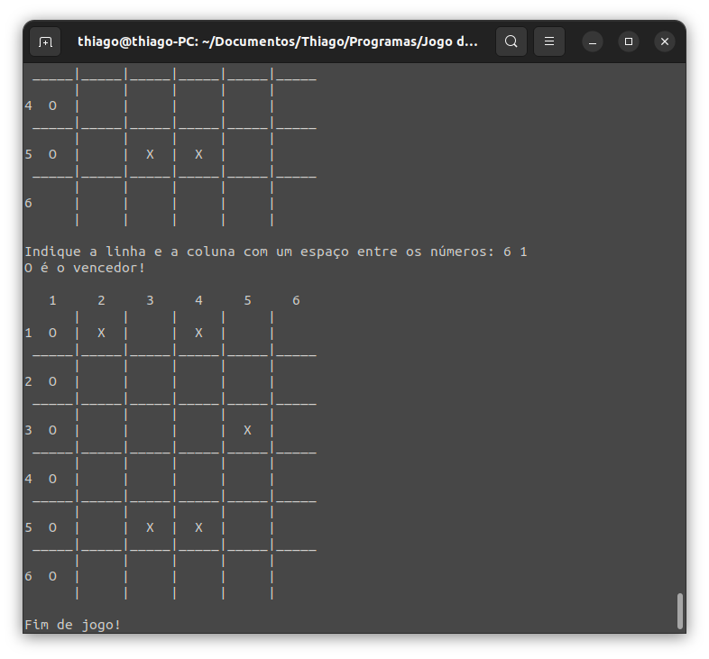

# Jogo da Velha em C

Este é um jogo da velha implementado em linguagem C. Ele permite que dois jogadores se enfrentem em um clássico jogo da velha, sendo um deles o computador.

## Screenshots


## Como Jogar

1. Pelo Terminal, compile o jogo:
    ```bash
    gcc main.c functions.c -o jogo_da_velha
    ```

2. Execute o jogo compilado.
    ```bash
    ./jogo_da_velha
    ```
3. Siga as instruções apresentadas no terminal para jogar o jogo.

## Funcionalidades

- **Interface de linha de comando**: Jogue o jogo diretamente no terminal.
- **Validação de Entrada**: Entradas inválidas são tratadas, garantindo que apenas movimentos válidos sejam aceitos.
- **Finalização de Jogo**: O jogo detecta automaticamente quando alguém vence ou quando há um empate.

## Diferencial

-  Neste jogo da velha é possível alterar o tamanho ```3``` do mapa por ser uma matriz quadrada. Os algoritmos que imprimem o mapa e procuram por um ganhador foram criados para se adaptarem a qualquer tamanho de uma matriz quadrada. Para alterar o tamanho do mapa é preciso criar um arquivo ```mapa.txt``` na mesma pasta do jogo e com o valor da matriz.

    Exemplo:

    Em ```mapa.txt```:

    ```bash
    6
    ```

    O mapa será uma matriz 6x6:
    

## Contribuindo

- Sinta-se à vontade para contribuir com melhorias, novas funcionalidades ou correções de bugs.

## Licença

Este projeto está licenciado sob a [MIT License](LICENSE).
